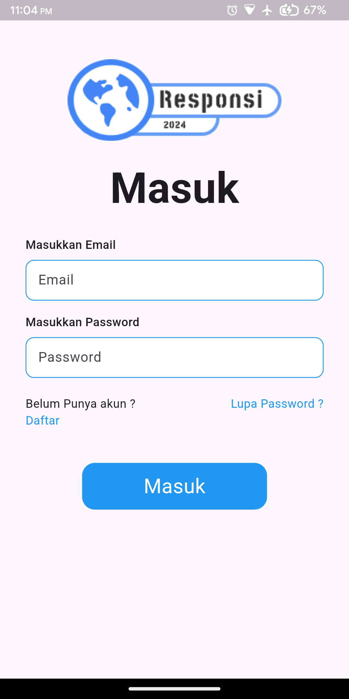
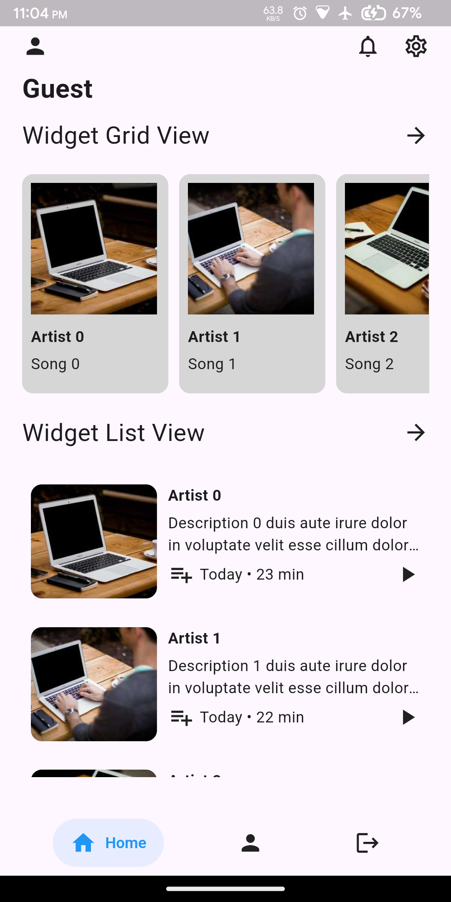
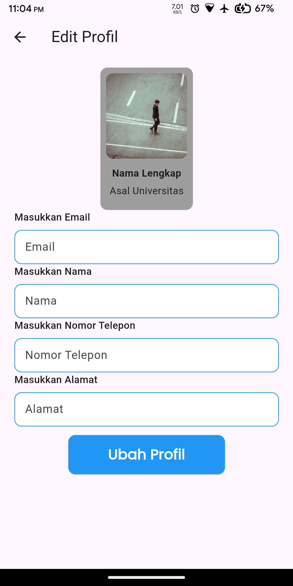
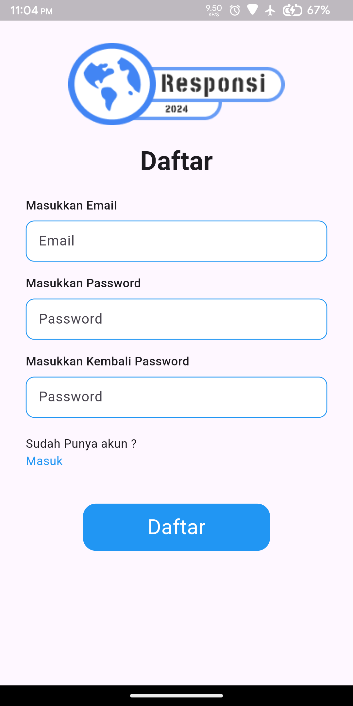
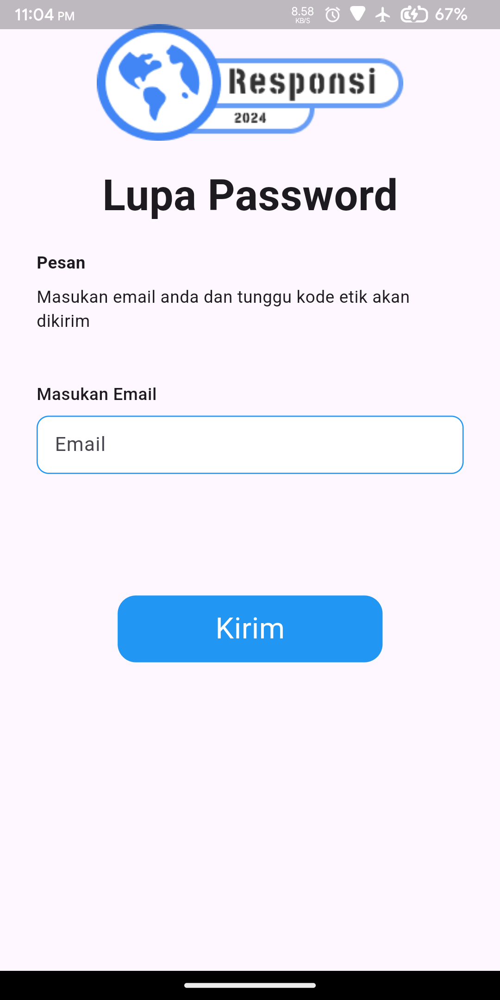
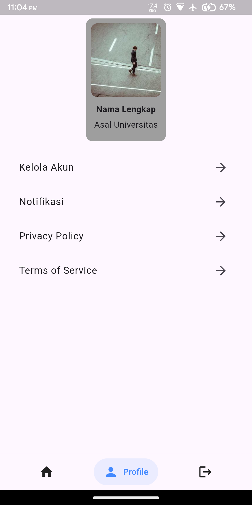
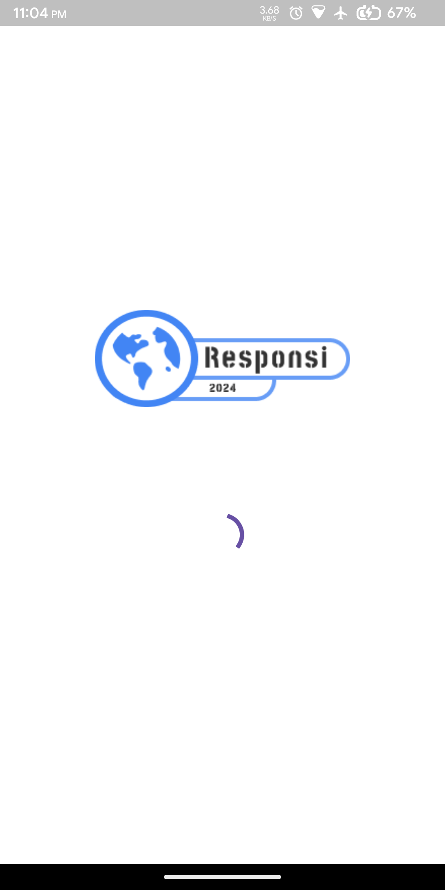

# tgs2_responsi

A new Flutter project showcasing various functionalities.

## Screenshots

Here are some screenshots of the application:

| Login Screen | Home Screen |
|--------------|-------------|
|  |  |
| Edit Profile | Register |
|  |  |
| Forget Password | Profile |
|  |  |
| Splash Screen |
|  | 
